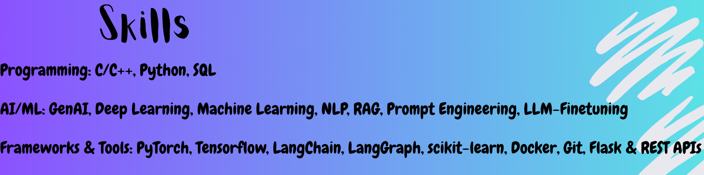

  

<h1 align="center">Hi there, I'm Arkya Bagchi 👋</h1>

  <em>M.Tech in Artificial Intelligence @ IIT Jodhpur | Ex. Data Scientist @ Ecom Express</em>
    
  My passion lies in bridging advanced AI research with practical, scalable deployment. I specialize in <b>Generative AI</b> and <b>Multimodal Learning</b>, with projects focused on Vision-Language LLMs for medical imaging and sophisticated Retrieval-Augmented Generation (RAG) systems. My work is grounded in hands-on experience with <b>MLOps</b>, including deploying and managing systems with Docker, Kafka, and AWS.

   &nbsp;
   &nbsp;
  

  

<h2 align="center">My Tech Stack 🛠️</h2>

  <b>Programming</b> 
  

  <b>AI/ML Concepts</b> 
  Generative AI • Deep Learning • Machine Learning • NLP • RAG • Prompt Engineering • LLM Fine-Tuning

  <b>Frameworks & MLOps Tools</b> 
  
  

<h2 align="center">My GitHub Stats 📊</h2>

  
  

